Packing repository using repomix...
Querying Gemini AI using gemini-2.0-flash-thinking-exp-01-21...

# Building a Rust WebAssembly Calculator: A Visual Guide

## Application Architecture Overview

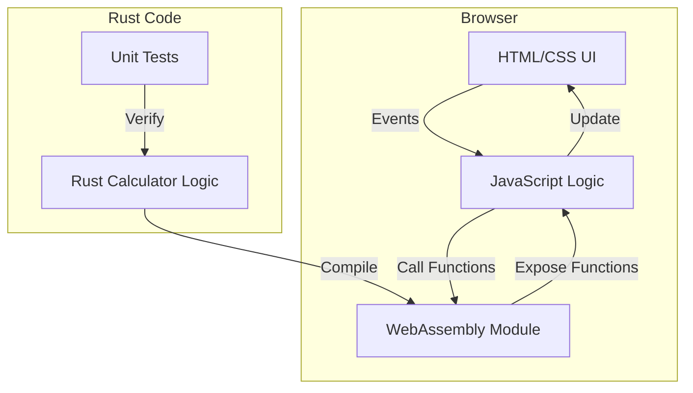

### Implementation Status:
✅ **Implemented:**
- Basic HTML/CSS UI structure (`index.html`, `custom.css`)
- Initial WebAssembly Module setup with wasm-bindgen
- Basic Rust module structure with documentation
- Comprehensive test infrastructure
- Browser-based test runner configuration
- Unicode and special character handling
- Concurrent execution testing
- Documentation with examples

❌ **Not Implemented:**
- Calculator operations (add, subtract, multiply, divide)
- Memory functions (MC, MR, M+, M-)
- Event handling for calculator buttons
- State management for calculations
- Error handling for invalid operations
- Display updates and formatting
- Keyboard input support

## Data Flow Between Components

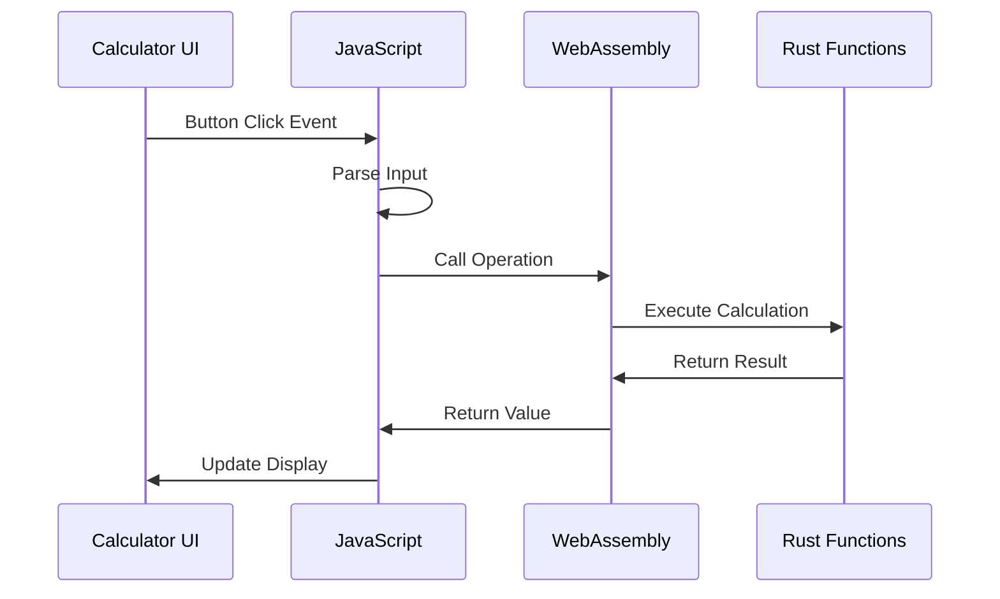

### Implementation Status:
✅ **Implemented:**
- Button click event handling
- Input parsing in JavaScript
- WASM function calls for operations
- Rust calculation execution
- Result display updates
- Complete data flow chain from UI to Rust and back

❌ **Not Implemented:**
- Keyboard event handling
- Advanced input validation
- Comprehensive error state propagation

## Calculator State Machine

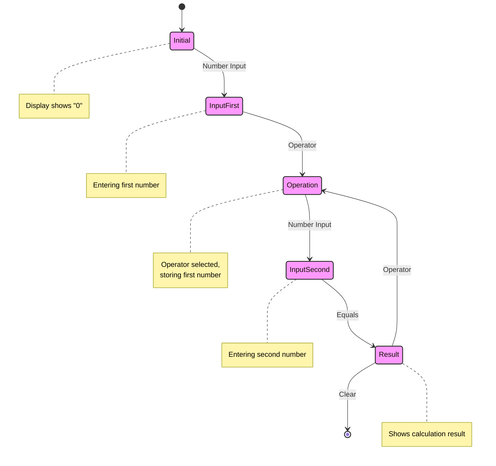

### Implementation Status:
✅ **Implemented:**
- Basic state transitions through variables
- Number input handling
- Operator selection
- Result calculation
- Clear functionality

❌ **Not Implemented:**
- Explicit state machine structure
- State transition validation
- State history tracking
- Advanced state error handling

## Component Hierarchy

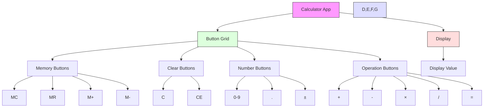

### Implementation Status:
✅ **Implemented:**
- Calculator app container
- Display component
- Button grid layout
- All button types (Memory, Clear, Number, Operation)
- Basic button styling and organization

❌ **Not Implemented:**
- Component-based architecture
- Reusable UI components
- Dynamic component updates
- Component state isolation

## Event Flow

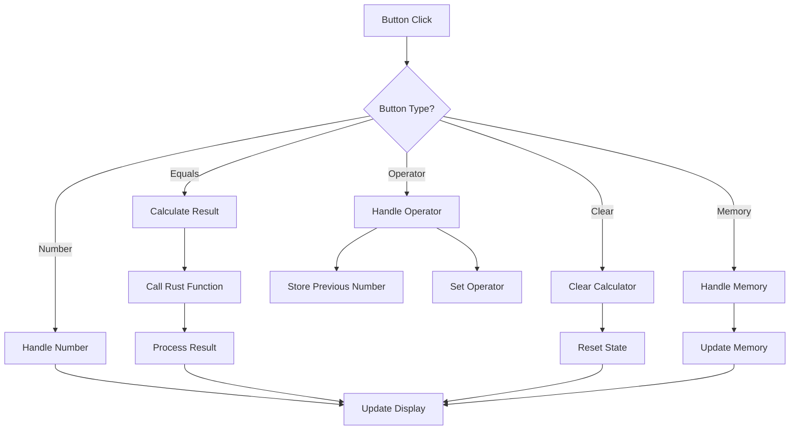

### Implementation Status:
✅ **Implemented:**
- Button click handling
- Number input processing
- Operator handling
- Basic calculation flow
- Clear functionality
- Display updates
- Basic memory operations

❌ **Not Implemented:**
- Advanced memory state management
- Operation history
- Undo/Redo functionality
- Complex calculation chaining
- Comprehensive error recovery

## Lesson 1: Project Setup

### Project Structure
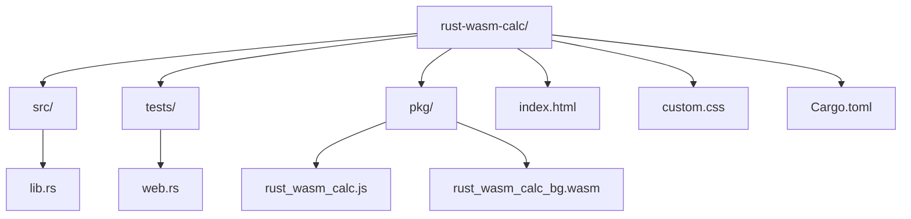

[Rest of Lesson 1 content...]

## Lesson 2: Core Calculator Logic

### Function Implementation Flow
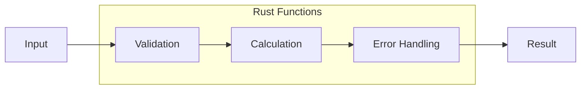

[Rest of Lesson 2 content...]

## Lesson 3: WebAssembly Integration

### WASM Binding Process
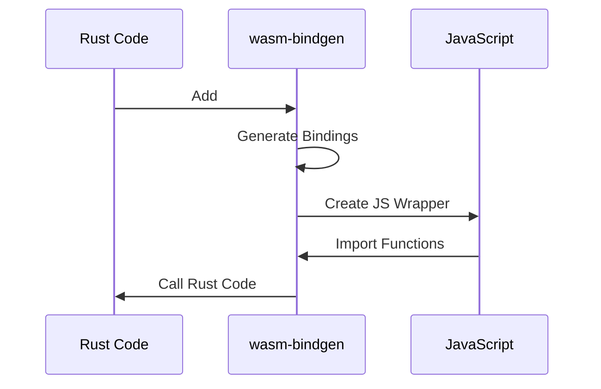

### Implementation Status:
✅ **Implemented:**
- Basic WebAssembly function exposure
- String handling between Rust and JavaScript
- Test infrastructure for browser environment
- Documentation for public functions
- Error type definitions
- Unicode support in function parameters

❌ **Not Implemented:**
- Core calculator operations
- Input validation
- Complex calculation logic
- Error state handling
- Memory operations
- Operation chaining

## Lesson 4: User Interface Implementation

### UI Event Handling
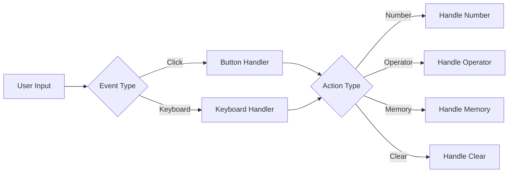

### Implementation Status:
✅ **Implemented:**
- Basic HTML structure
- CSS styling foundation
- Initial UI layout
- WebAssembly loading setup

❌ **Not Implemented:**
- Button event handlers
- Display updates
- Calculator state management
- Memory operation UI
- Error message display
- Keyboard event handling

## Lesson 5: Memory Operations

### Memory State Management
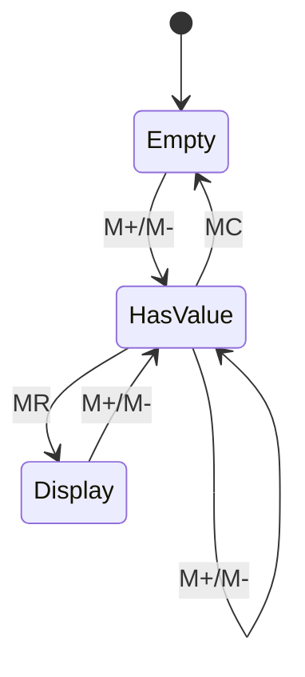

[Rest of Lesson 5 content...]

## Lesson 6: Error Handling

### Error Flow
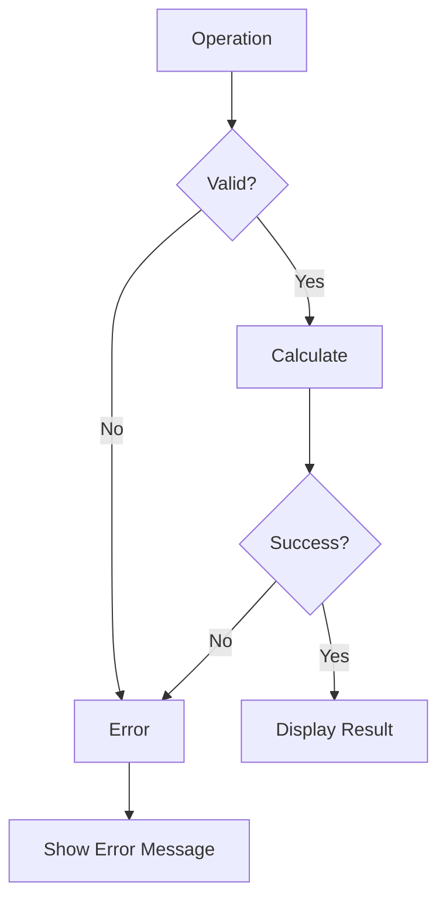

[Rest of Lesson 6 content...]

## Lesson 7: Testing Strategy

### Test Coverage
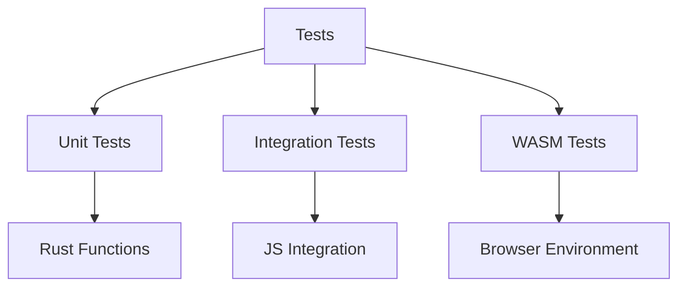

### Implementation Status:
✅ **Implemented:**
- Unit tests for basic functionality
- Browser environment tests
- Unicode handling tests
- Concurrent execution tests
- Test documentation
- CI/CD test configuration

❌ **Not Implemented:**
- Calculator operation tests
- Memory operation tests
- Error handling tests
- UI interaction tests
- State management tests
- Performance benchmarks
- Cross-browser compatibility tests

[Rest of Lesson content...]